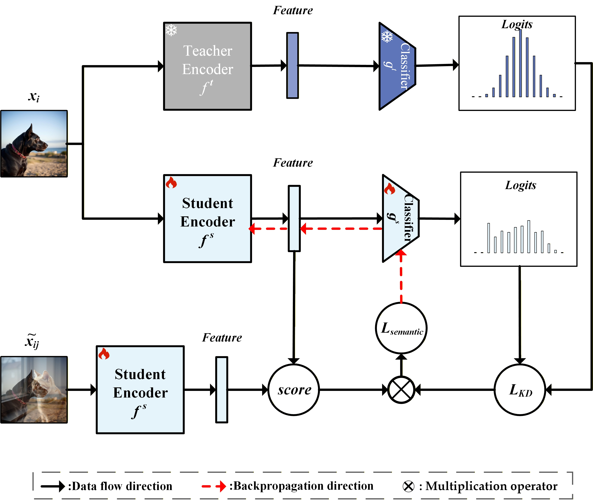

# Knowledge Distillation for Semantically Inconsistent Data

## Introduction
This repository contains a PyTorch implementation of [Knowledge Distillation for Semantically Inconsistent Data] based on the [mdistiller](https://github.com/megvii-research/mdistiller) codebase. Our method identifies the semantically inconsistent data and upweights them for knowledge distillation, and reports state-of-the-art performance on CIFAR-100, Tiny-ImageNet, and ImageNet datasets.

<p align="center">
    
</p>

This code is based on the implementation of [CRLD](https://github.com/arcanienz/CRLD) and [MLLD](https://github.com/Jin-Ying/Multi-Level-Logit-Distillation).
For environment set-up, data organisation, and pretrained models, please refer to [CRLD](https://github.com/megvii-research/mdistiller).

If you want to get the pretrained weights of teacher models, please visit [MLLD](https://github.com/Jin-Ying/Multi-Level-Logit-Distillation).

## Training
We have implemented our method into CRLD, MLLD and ReviewKD. If you want to experiment our method along with CRLD on for CIFAR-100, you may do
```bash
    python tools/train_ours.py --cfg configs/cifar100/crld_ours/res32x4_res8x4.yaml
```


## Citation
If you find our paper helpful to your work, you may cite it as:
```
@inproceedings{KDfSID,
author = {Teng Lu, Zhi Chen, Jiang Duan, Uwe Aickelin, Hongyan Xu, Guoping Qiu},
title = {Knowledge Distillation for Semantically Inconsistent Data},
booktitle = {PR},
year = {2026}
}
```
